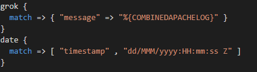

# Logstash Configuration Syntax / Language Support

Adds syntax highlighting for logstash configuration files.

The initial language grammar was ever so lovingly taken from the SublimeText extension created by the SublimeText extension created by [niros](https://github.com/nir0s/sublime-logstash-syntax-highlighter). 

[Project Page](https://github.com/randomchance/vscode-logstash-configuration-syntax)

## Features

Some of the words are different colors, it's amazing. 

Automatically detects files that match:

* `*logstash.conf`
* `*logstash.conf.j2`
* `*logstash.conf.template`

## Known Issues

## Release Notes

* `0.0.4` Fixed strings with quotes.
* `0.0.3` Fixed [Language comment functionality uses incorrect syntax](https://github.com/randomchance/vscode-logstash-configuration-syntax/issues/1), comment shortcuts should work now. 
